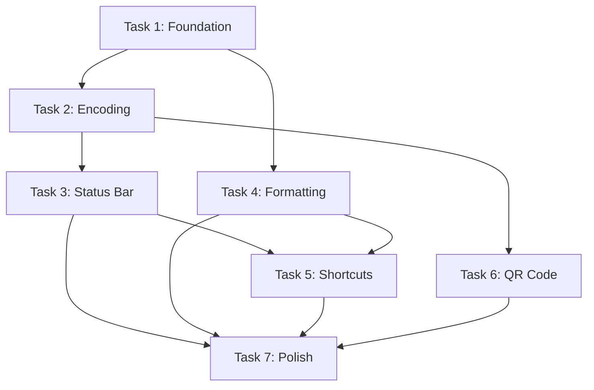

# Static Notes PRD

> Single-file note sharing app with URL-encoded data

| Field | Value |
|-------|-------|
| **Type** | PRD |
| **Status** | Approved |
| **Domain** | Frontend |
| **Priority** | P0 - Critical |
| **Created** | 2026-02-04 |

---

## Problem

**Surface Request:** Single index.html file note app with data encoded in URL for sharing

**Root Problem:** Users need instant note sharing without accounts, servers, or data retention concerns

**Affected:** End users, developers, teams, personal use

**Impact:** Without this, users must rely on external services with accounts, storage costs, and privacy concerns

---

## Outcome

Single index.html with inline CSS/JS that encodes note content into URL hash using lz-string compression. Copy the URL, share it anywhere, recipient opens it and sees the note.

---

## Success Criteria

- [ ] User can write a note and share it via URL
- [ ] Recipient opens URL and sees the exact same note content
- [ ] App works completely offline after initial load
- [ ] URL stays under 8000 chars for typical notes with compression
- [ ] QR code is scannable and loads the note

---

## Acceptance Criteria

- [ ] Single HTML file with no external dependencies (lz-string inlined)
- [ ] Note content survives encode/decode round-trip
- [ ] URL updates within 500ms of typing
- [ ] Works offline once loaded
- [ ] Mobile responsive down to 320px viewport
- [ ] Dark mode activates via system preference

---

## Boundaries

### In Scope

- Single HTML file with inline CSS and JS
- URL-encoded note content using lz-string
- Contenteditable editor with basic formatting
- Live URL preview with debounced updates
- Share button with copy-to-clipboard
- QR code generation
- Keyboard shortcuts
- Character/byte counter
- Dark/light mode via system preference
- Mobile responsive layout

### Out of Scope

| Item | Reason | Status |
|------|--------|--------|
| Server-side storage | Defeats purpose of URL-only sharing | Rejected |
| User accounts | No server, no accounts needed | Rejected |
| Real-time collaboration | Single-user, static file | Deferred |
| Full rich text editor | Keep it simple, basic formatting only | Deferred |
| File attachments | URL length limits | Rejected |
| Markdown rendering | Future enhancement | Deferred |
| URL shortening integration | External dependency, users can do manually | Deferred |

---

## Assumptions

| Assumption | Status | Impact |
|------------|--------|--------|
| lz-string library provides sufficient compression for typical notes | Validated | High |
| Users will share URLs via messaging apps that preserve full URL | Unknown | Medium |
| Browser URL limits of ~8000 chars are sufficient for most use cases | Validated | High |
| System prefers-color-scheme is widely supported | Validated | Low |

---

## Requirements

| ID | Requirement | Priority | MoSCoW |
|----|-------------|----------|--------|
| R1 | Encode note content to URL hash using lz-string compression | P0 | Must |
| R2 | Decode URL hash and display note on page load | P0 | Must |
| R3 | Provide contenteditable editor with native undo/redo | P0 | Must |
| R4 | Update URL in real-time as user types (debounced 500ms) | P0 | Must |
| R5 | Copy URL to clipboard on Share button click | P0 | Must |
| R6 | Display character count and URL length | P1 | Should |
| R7 | Show warning when URL exceeds 2000/8000 chars | P1 | Should |
| R8 | Support bold/italic formatting | P1 | Should |
| R9 | Generate QR code from current URL | P1 | Should |
| R10 | Keyboard shortcuts for common actions | P2 | Could |
| R11 | Auto dark/light mode via prefers-color-scheme | P1 | Should |
| R12 | Mobile responsive layout | P0 | Must |

---

## User Journeys

### 1. Create and Share Note

**Actor:** Note Creator
**Goal:** Share a quick note via URL

1. Open index.html in browser
2. Type or paste content in editor
3. See URL update in status bar
4. Click Share button or press Ctrl+S
5. URL copied to clipboard
6. Paste and share via any medium

**Edge Cases:** Very long note exceeds URL limits, special characters/unicode, empty note

### 2. View Shared Note

**Actor:** Note Recipient
**Goal:** Read a note shared via URL

1. Receive URL from sender
2. Click or paste URL in browser
3. Note content loads automatically
4. Optionally edit and re-share with new URL

**Edge Cases:** Corrupted or truncated URL, old browser without lz-string support

### 3. QR Code Sharing

**Actor:** Note Creator
**Goal:** Share note via QR code for mobile

1. Write note in editor
2. Click QR code button
3. QR modal appears with scannable code
4. Recipient scans with phone camera
5. Note opens in mobile browser

**Edge Cases:** URL too long for QR code, low contrast QR in dark mode

### 4. URL Shortener Workaround

**Actor:** Note Creator
**Goal:** Share long note that exceeds URL limits

1. Write longer note, see yellow/red warning
2. Copy the full long URL
3. Paste into Bitly/TinyURL
4. Get shortened link
5. Share shortened link

**Note:** URL shorteners store the complete original URL and perform server-side redirects, preserving all encoded note data.

---

## Technical Approach

### Architecture

Single HTML file with inline CSS in `<style>` and inline JS in `<script>`. No build step, no external dependencies.

### Component Structure

```
index.html
├── <style> (inline CSS)
│   ├── CSS reset
│   ├── Theme variables (--color-bg, --color-text, etc.)
│   ├── Layout (header, main, footer)
│   └── Components (editor, toolbar, modal)
├── <body>
│   ├── Header (title)
│   ├── Editor (contenteditable div)
│   ├── Toolbar (Bold, Italic buttons)
│   ├── Status bar (char count, URL length, warnings)
│   ├── Actions (Share, QR, Clear buttons)
│   └── QR Modal (hidden by default)
└── <script> (inline JS)
    ├── lz-string library (inlined)
    ├── qrcode-generator library (inlined)
    ├── encode/decode functions
    ├── URL sync with debounce
    ├── Keyboard shortcut handlers
    └── Event listeners
```

### Encoding Strategy

**Library:** [lz-string](https://github.com/pieroxy/lz-string) (~5KB)

- Uses `compressToEncodedURIComponent()` for URL-safe compression
- LZ-based algorithm provides ~50-70% compression on text
- Well-tested, actively maintained

**URL Structure:**
```
https://example.com/index.html#[compressed-data]
```

Using hash (`#`) instead of query params because:
- No server-side processing needed
- Hash changes don't trigger page reload
- Cleaner URLs

---

## Tasks

### Task 1: Foundation - HTML Structure and Base Styles

**Priority:** P0 | **Estimate:** M (2-3 hours)

Create the base HTML structure with semantic elements, CSS reset, theme variables for light/dark mode, and responsive layout scaffolding.

**Acceptance Criteria:** HTML file renders with header, editor area, toolbar, status bar, and action buttons. Dark/light mode switches based on system preference. Layout is responsive.

**Test:** Open in browser, verify all sections render. Toggle system dark mode and verify theme changes. Resize to 320px and verify layout adapts.

**Subtasks:**
- [ ] 1.1 Create base HTML structure with semantic elements
- [ ] 1.2 Add CSS reset and theme variables for light/dark mode
- [ ] 1.3 Implement responsive layout with CSS Grid/Flexbox
- [ ] 1.4 Add contenteditable div with placeholder styling

---

### Task 2: Core Encoding - lz-string Integration

**Priority:** P0 | **Estimate:** M (2-3 hours) | **Depends on:** Task 1

Integrate lz-string library (inlined), implement encode/decode functions, wire up URL hash sync.

**Acceptance Criteria:** Typing in editor updates URL hash. Opening URL with hash populates editor with decoded content. Round-trip preserves content exactly.

**Test:** Type 'Hello World', verify URL hash changes. Copy URL, open in new tab, verify 'Hello World' appears. Test with special chars and unicode.

**Subtasks:**
- [ ] 2.1 Inline lz-string library in script tag
- [ ] 2.2 Implement encode(text) function
- [ ] 2.3 Implement decode(hash) function
- [ ] 2.4 Add debounced URL update on editor input (500ms)
- [ ] 2.5 Load and decode content from URL hash on page load

---

### Task 3: Status Bar and Feedback

**Priority:** P0 | **Estimate:** S (1-2 hours) | **Depends on:** Task 2

Implement character counter, URL length indicator, warning thresholds, and copy-to-clipboard functionality.

**Acceptance Criteria:** Status bar shows live character count and URL length. Yellow warning at 2000 chars, red at 8000. Share button copies URL and shows feedback.

**Test:** Type text, verify counters update. Paste long text until warnings appear. Click Share, verify clipboard contains URL.

**Subtasks:**
- [ ] 3.1 Add character counter that updates on input
- [ ] 3.2 Add URL length indicator
- [ ] 3.3 Implement warning thresholds with visual feedback
- [ ] 3.4 Implement copy-to-clipboard for Share button

---

### Task 4: Formatting Toolbar

**Priority:** P1 | **Estimate:** S (1-2 hours) | **Depends on:** Task 1

Add formatting toolbar with bold/italic buttons, implement execCommand, ensure formatting survives encoding.

**Acceptance Criteria:** Bold and italic buttons work. Formatted text encodes to URL and decodes back with formatting preserved.

**Test:** Select text, click Bold, verify bold. Encode, decode, verify still bold. Same for italic.

**Subtasks:**
- [ ] 4.1 Add formatting toolbar with Bold and Italic buttons
- [ ] 4.2 Implement execCommand for bold and italic
- [ ] 4.3 Ensure innerHTML encoding preserves formatting

---

### Task 5: Keyboard Shortcuts

**Priority:** P1 | **Estimate:** S (1 hour) | **Depends on:** Tasks 3, 4

Implement keyboard shortcuts for copy URL, clear note, and formatting.

**Acceptance Criteria:** Ctrl+S copies URL, Ctrl+L clears note, Ctrl+B/I toggle formatting. Works on Mac with Cmd.

**Test:** Press each shortcut, verify expected action. Test on Mac if available.

**Subtasks:**
- [ ] 5.1 Implement Ctrl/Cmd+S to copy URL
- [ ] 5.2 Implement Ctrl/Cmd+L to clear note
- [ ] 5.3 Implement Ctrl/Cmd+B and Ctrl/Cmd+I for formatting

---

### Task 6: QR Code Generation

**Priority:** P1 | **Estimate:** M (2-3 hours) | **Depends on:** Task 2

Add QR code generation library (inlined), create modal, generate QR from current URL.

**Acceptance Criteria:** QR button opens modal with scannable QR code. Modal can be closed. QR encodes current URL.

**Test:** Click QR button, verify modal opens. Scan QR with phone, verify it opens the note URL. Close modal.

**Subtasks:**
- [ ] 6.1 Inline QR code generation library (qrcode-generator)
- [ ] 6.2 Create QR modal with close button and backdrop
- [ ] 6.3 Generate QR code on button click from current URL
- [ ] 6.4 Handle long URLs gracefully

---

### Task 7: Polish and Testing

**Priority:** P1 | **Estimate:** M (2-3 hours) | **Depends on:** Tasks 3, 4, 5, 6

Final polish including mobile testing, cross-browser testing, loading states, and CSS refinements.

**Acceptance Criteria:** App works on mobile Safari/Chrome, desktop Chrome/Firefox/Safari/Edge. Smooth animations, polished UI.

**Test:** Test on multiple devices and browsers. Verify all features work. Check accessibility basics.

**Subtasks:**
- [ ] 7.1 Test and fix mobile responsiveness issues
- [ ] 7.2 Test and fix dark/light mode transitions
- [ ] 7.3 Cross-browser testing and fixes
- [ ] 7.4 Add loading state for initial decode
- [ ] 7.5 Final CSS polish and micro-animations

---

## Dependencies

### Task Dependencies



### Critical Path

1 → 2 → 3 → 5 → 7 (~8-12 hours)

### Parallel Tracks

- **Core:** Tasks 1, 2, 3
- **Features:** Tasks 4, 5, 6 (can start after Task 1)

---

## Estimation

| Metric | Value |
|--------|-------|
| Method | T-shirt sizing |
| Total Effort | 12-17 hours |
| Buffer | 3 hours |
| **Total with Buffer** | **15-20 hours** |

---

## Risks

| Risk | Probability | Impact | Mitigation |
|------|-------------|--------|------------|
| URL length limits break sharing in some apps | Medium | Medium | Show clear warnings, document URL shortener workaround |
| lz-string compression insufficient for large notes | Low | Medium | Test with realistic content, document limits |
| contenteditable behavior varies across browsers | Medium | Low | Test thoroughly, use execCommand which is well-supported |
| QR codes fail for very long URLs | Medium | Low | Show warning, still generate QR which may work |

---

## Test Requirements

| Type | Description |
|------|-------------|
| Unit | Test encode/decode functions with various inputs (empty, unicode, special chars) |
| Integration | Full round-trip: type → encode → copy URL → new tab → decode → verify |
| E2E | User flows: create note, share, view shared, QR code scan |
| Visual | Mobile responsive at 320px, dark/light mode, button states |

---

## Non-Functional Requirements

| Category | Requirement |
|----------|-------------|
| Initial Load | < 100ms |
| Encode/Decode | < 50ms for typical notes |
| Bundle Size | < 50KB total |
| Browser Support | Chrome 90+, Firefox 90+, Safari 14+, Edge 90+ |
| Accessibility | Basic keyboard navigation and focus states |

---

## Phase Gates

### GATE: Core MVP
- [ ] Can type in editor
- [ ] URL updates with encoded content
- [ ] Opening URL displays decoded content
- [ ] Share button copies URL

### GATE: Feature Complete
- [ ] Formatting works and persists
- [ ] QR code generates and scans
- [ ] Keyboard shortcuts work
- [ ] Warnings display correctly

### GATE: Release Ready
- [ ] Mobile responsive verified
- [ ] Cross-browser tested
- [ ] Dark/light mode works
- [ ] All polish items complete

---

## References

- [lz-string GitHub](https://github.com/pieroxy/lz-string)
- [lz-string Documentation](https://pieroxy.net/blog/pages/lz-string/index.html)
- [qrcode-generator](https://github.com/kazuhikoarase/qrcode-generator)
- [Compressing Websites into URLs](https://leanrada.com/notes/compressing-websites-into-urls/)

---

## User Tips

### URL Shortener Workaround

For long notes exceeding ~2000 chars, paste the full URL into Bitly or TinyURL. These services store the complete original URL and redirect to it, preserving all encoded note data.

---

*Generated by Morgoth PRD • Session: static-notes • Approved: 2026-02-04*
